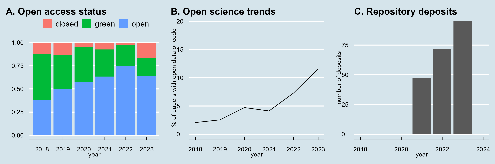
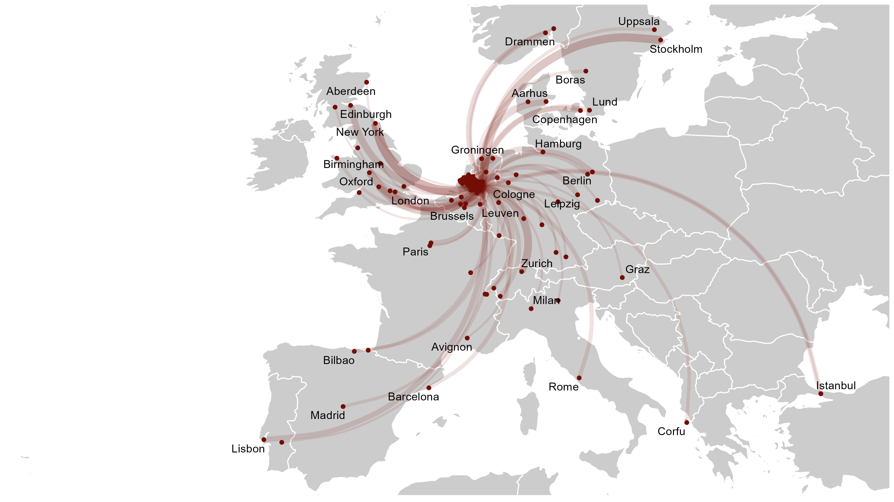
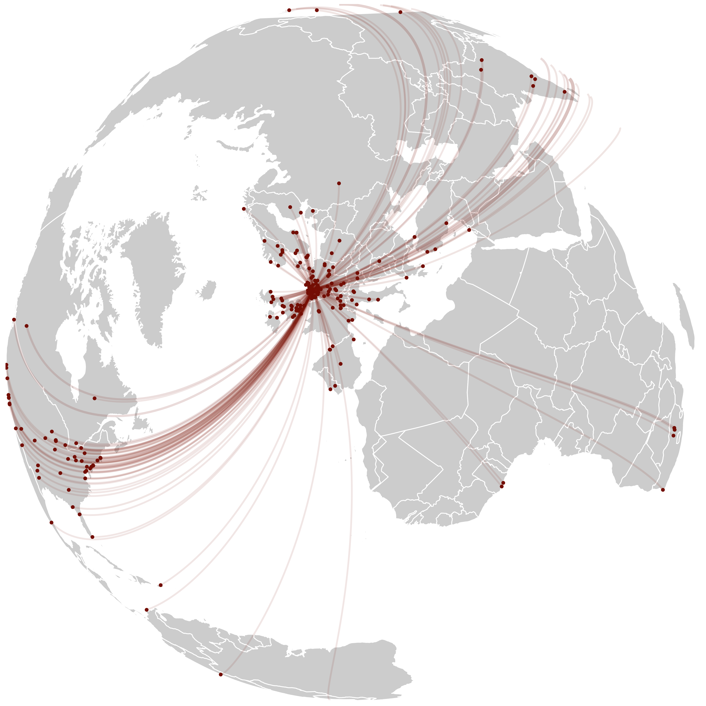

# cls-biblio
Bibliometrics for the Centre for Language Studies, Radboud University Nijmegen, 2018-2023

This repository contains bibliometric data and figures prepared for the external evaluation of the Centre for Language Studies of the period 2018-2023.

Some people have been interested in the collaboration maps. I couldn't find a good database or data source that could generate these so I made them on the basis of Web of Science affiliation metadata which I geocoded and mapped in R. I share my code because I tend to forget how to do this myself.

# What's in here
* A bunch of source data files in [data](data)
* [cls-biblio-01-data-processing.R](cls-biblio-01-data-processing.R)
* [cls-biblio-02-figure.R](cls-biblio-02-figures.R)
* [cls-biblio-02-map.R](cls-biblio-02-map.R)

# Example figures

Open access status, open science trends, and data deposits of CLS publications. Data from Unpaywall (A) and Radbodu Repository, Open Science Foundation and Github (B, C). Data and code for this figure in [cls-biblio-02-figure.R](cls-biblio-02-figures.R).

CLS network in Europe, based on co-authored publications. Only places featuring two or more occurrences are included. Data and code for this figure in [cls-biblio-02-map.R](cls-biblio-02-map.R).

CLS collaborations 2018-2023, based on co-authored publications. Data and code for this figure in [cls-biblio-02-map.R](cls-biblio-02-map.R).

CLS collaborations 2018-2023, based on co-authored publications. Data and code for this figure in [cls-biblio-02-map.R](cls-biblio-02-map.R).

