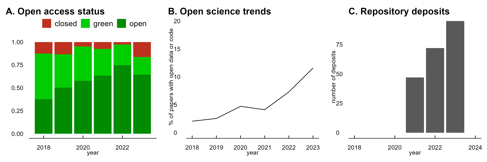

# cls-biblio
Bibliometrics for the Centre for Language Studies, Radboud University Nijmegen, 2018-2023

This repository contains bibliometric data and figures prepared for the external evaluation of the Centre for Language Studies of the period 2018-2023.

Open access status, open science trends, and data deposits of CLS publications. Data from Unpaywall (A) and Radbodu Repository, Open Science Foundation and Github (B, C). Data and code for this figure in [cls-biblio-02-figure.R](cls-biblio-02-figures.R).

CLS collaborations 2018-2023, based on co-authored publications. Data and code for this figure in [cls-biblio-02-map.R](cls-biblio-02-map.R).
